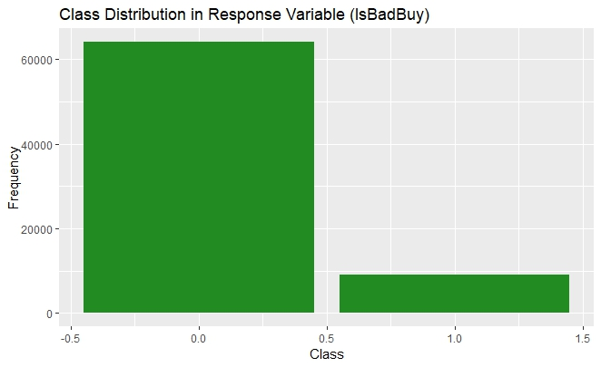

<!--more-->  

Kaggle competitions are a great way to test your machine learning skills on real-world data. The [**Don't Get Kicked**](https://www.kaggle.com/competitions/DontGetKicked) challenge was all about predicting which used cars 🚗 at auction would turn out to be lemons—meaning they had major issues that made them a poor investment.  

In this post, I'll walk through my approach, the models I tested, and what I learned along the way. If you'd like to dive in to my code, check out my [repository on github](https://github.com/katelynnelson38/kaggle_dont_get_kicked).

## Exploring the Data  

The dataset contained information about used cars sold at auctions, including details like the manufacturer, vehicle age, mileage, and pricing estimates. The goal? To predict whether a car was a bad buy (`IsBadBuy = 1`).  

📌A few quick takeaways from my initial exploration:  

- Some categorical features had *a ton* of levels (like `Model` and `Trim`), which could make modeling tricky.  
- There were missing values, especially in variables like `PRIMEUNIT` and `AUCGUART`.  
- The dataset was imbalanced—only about 12% of the cars were labeled as bad buys.  

    
    

        

        

    

## Feature Engineering & Preprocessing  

To prep the data for modeling, I used the **tidymodels** framework and built a preprocessing pipeline with these steps:  

- Convert categorical variables into factors.  
- Remove high-cardinality features (`Model`, `Trim`, etc.).  
- Drop highly correlated numeric variables.  
- Impute missing values using median/mode.  
- Apply **SMOTE** to balance the classes (optional for some models).  

**Suggested Plot:** Correlation heatmap or feature importance ranking.  

---

## Trying Different Models  

I experimented with several classification models to see what worked best. Here's a quick rundown:  

### Logistic Regression  
- Simple but effective baseline.  
- Used **L1/L2 regularization** to avoid overfitting.  

### Naive Bayes  
- Worked well on small datasets but struggled with some features.  
- Performed better when normalized.  

### k-Nearest Neighbors (KNN)  
- Struggled with the **high-dimensionality** of the dataset.  
- Needed heavy preprocessing and feature selection.  

### Decision Tree  
- Easy to interpret but prone to overfitting.  
- Performed decently after tuning depth and complexity.  

### Random Forest  
- Much better than a single decision tree.  
- Handled missing values and feature importance well.  

### XGBoost  
- Performed **best overall** after hyperparameter tuning.  
- Robust to missing data and imbalanced classes.  

### Support Vector Machine (SVM)  
- Required **scaling** of numeric features.  
- Slower to train but achieved solid accuracy.  

### Neural Network  
- Tried a simple MLP (multi-layer perceptron).  
- Didn't outperform tree-based models but was interesting to experiment with.  

**Suggested Plot:** Model comparison (ROC curves or AUC scores).  

---

## Results & Key Takeaways  

After tuning hyperparameters and evaluating on the test set, **XGBoost** came out on top 🏆. It consistently had the highest AUC score and performed well despite the class imbalance.  

A few key takeaways:  
- **Feature selection matters** – Removing redundant and high-cardinality features helped.  
- **Imbalanced data is tricky** – SMOTE and class weighting helped with certain models.  
- **Tree-based models dominated** – XGBoost and Random Forest were the clear winners.  

| Model                | Accuracy | Precision | Recall | AUC Score |
|----------------------|----------|-----------|--------|-----------|
| Logistic Regression |          |           |        |           |
| Naive Bayes         |          |           |        |           |
| k-NN                |          |           |        |           |
| Decision Tree       |          |           |        |           |
| Random Forest       |          |           |        |           |
| XGBoost            |          |           |        |           |
| SVM                |          |           |        |           |
| Neural Network     |          |           |        |           |

**Suggested Plot:** Final model performance table.  

---

## Next Steps  

While the final model performed well, there's always room for improvement! Some next steps I’d explore:  
- Trying **stacked models** to combine multiple approaches.  
- Fine-tuning hyperparameters further.  
- Feature engineering based on **domain knowledge**.  

Overall, this was a super fun project, and I learned a ton about handling imbalanced data and feature selection in a real-world dataset. Looking forward to the next challenge!  
